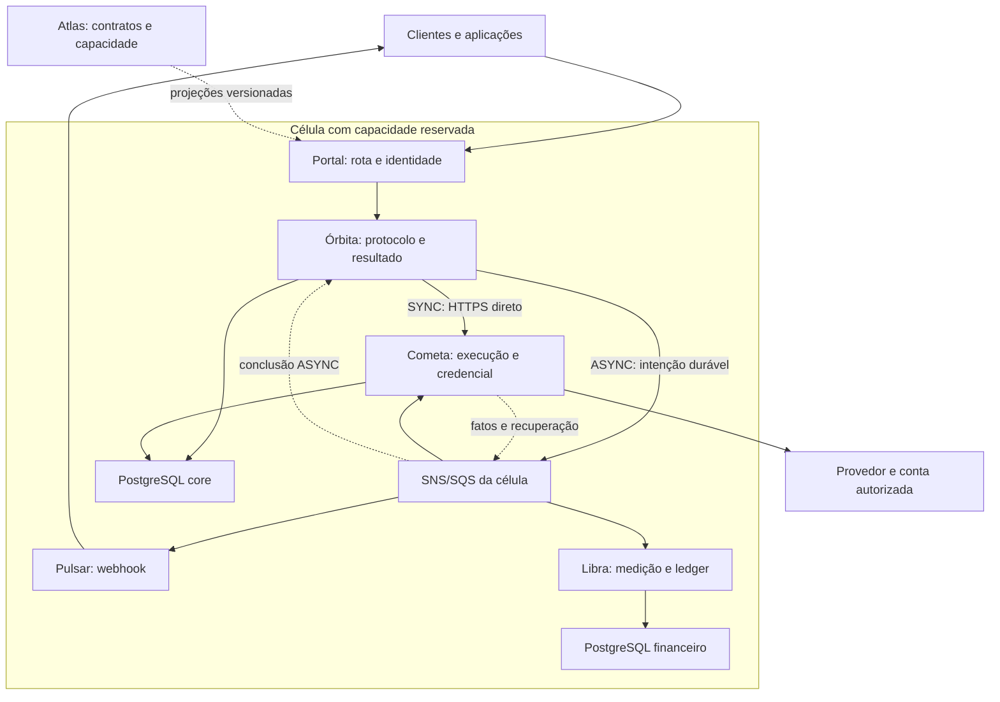

# 02 · Arquitetura e comunicação

## ARQ-01 · Fronteiras — proprietário: Arquitetura

Manter cinco aplicações de negócio e um gateway. Nomes são identificadores de trabalho e sempre aparecem junto da função.

| Componente | Autoridade e responsabilidades | Não lhe compete |
| --- | --- | --- |
| Portal — gateway | TLS, autenticação de borda, quotas técnicas, rotas, limites de payload | Orquestrar, precificar, ser banco de protocolo |
| Atlas — controle | Catálogo, contratos, planos, vínculos de credenciais, placement, capacidade desejada e configuração publicada | Fazer chamadas de provedores por requisição |
| Órbita — execução | Admissão, protocolo, idempotência, grafo, roteamento, estado final, resultado e consulta | Segredos de provedores, entrega de webhook, ledger |
| Cometa — integração | Operações/tentativas externas, adaptação, quotas de conta, callbacks, polling e evidência | Consolidar produto, decidir preço de venda |
| Pulsar — entrega | Obrigações de webhook, agenda, assinatura, tentativas e recibos | Reexecutar serviço para reentregar resposta |
| Libra — financeiro | Medição econômica, reservas estritas, apuração, lançamentos, conciliação, integração ERP | Inferir consumo somente de logs ou faturar todo evento técnico |

Órbita contém composição e roteamento. Cometa contém scheduler durável de polling e adaptadores. Não criar microserviço separado para cada adaptador ou temporizador por padrão; isolamento em deployments próprios é permitido por risco, capacidade ou dependência nativa, mantendo a autoridade de dados do domínio.

## ARQ-02 · Topologia de referência — proprietário: Arquitetura

O desenho mostra transportes, não acesso cruzado a schemas. Cometa e Órbita mantêm autoridades distintas no core; cada domínio grava somente seu estado. SYNC recebe de volta o fato externo já persistido pela resposta HTTPS; Órbita consolida/persiste o final e responde à conexão do cliente. Não espera que esse fato atravesse a fila. ASYNC usa filas/agenda e os mesmos invariantes. Eventos posteriores podem repetir a observação e são deduplicados.

Outras células repetem a organização. S3, cofre, identidade, telemetria e automação de infraestrutura são dependências explícitas em ARQ-03/05/06 e OPE-13; sua omissão gráfica não as torna inexistentes. Atlas distribui projeções versionadas e solicita expansão; o tráfego estabelecido não consulta Atlas/Crossplane a cada pedido. O diagrama SVG detalha o caminho direto e o desacoplamento de eventos.

## ARQ-03 · Escolha tecnológica — proprietário: Arquitetura

| Camada | Decisão de referência v4 | Critério |
| --- | --- | --- |
| Aplicações | Go em versão estável suportada, fixada na implementação | Uniformidade, concorrência limitada, profiling; sem promessa de desempenho pela linguagem |
| Banco transacional | PostgreSQL; banco de controle e bancos core/finance por célula de execução | ACID, unicidade, integridade, RLS e independência financeira |
| Barramento | SNS + SQS Standard, fila por consumidor e domínio de isolamento | Distribuição de fatos e entrega ao menos uma vez; ordem não presumida |
| Arquivos | S3, chaves/versões imutáveis | Arquivos fora do broker e das linhas transacionais volumosas |
| Segredos | Secrets Manager + KMS na referência AWS | Rotação e acesso por identidade de workload |
| Execução remota | Kubernetes, referência EKS multi-AZ | Escala por responsabilidade, infraestrutura gerenciada |
| Gateway | Kong, edição/plugins sujeitos à validação | API management; não deslocar regras de negócio para plugins |
| Observabilidade | OpenTelemetry, Prometheus, Grafana, Loki e Alloy; backend de traces Tempo | Métricas, logs e traces correlacionados |
| Cache | L1 local; Redis L2 opcional com bypass | Funcionar e cumprir SLO qualificado sem Redis |
| Expansão de capacidade | HPA/KEDA, Karpenter e Crossplane no plano de plataforma | Réplicas, nós e células gerenciados por políticas; funções distintas |

AWS continua sendo a referência da v1, não uma infraestrutura já contratada. Conta, região e orçamento devem ser aprovados em P-01. Se for necessário operar sem serviços AWS, uma nova decisão deverá selecionar broker e armazenamento equivalentes e requalificar semântica; compatibilidade de API não prova equivalência operacional. Nenhuma recomendação aqui equivale a seleção de versão de pacote ou aprovação de licenciamento.

## COM-01 · Comunicação interna definida — proprietário: Arquitetura / Engenharia

| Origem → destino | Tipo definido | Contrato e razão |
| --- | --- | --- |
| Portal → Órbita / Atlas | HTTPS REST/JSON canônico, HTTP/2 quando negociado; HTTP/1.1 compatível; adaptação legada na fronteira da Órbita | APIs públicas e administrativas com autenticação e autorização |
| Órbita → Cometa em SYNC | HTTPS REST/JSON interno idempotente, mTLS e deadline propagado | Execução direta após intenção durável; retorno interno do final externo persistido, sem broker no percurso obrigatório |
| Órbita → Cometa em ASYNC | Comando durável em SQS dedicada à célula/classe | Execução e trabalho diferido; cancelamento/compensação seguem pré-condições e agenda |
| Cometa → Órbita em SYNC | Resposta HTTPS da operação direta; consulta interna por operation_id para recuperação segura | Dados já persistidos no Cometa; Órbita materializa o final do cliente antes de responder |
| Cometa → Órbita e Libra | Fatos via SNS com filas SQS independentes | Resultado observado e consumo externo; fan-out confiável |
| Órbita → Pulsar e Libra | Fato final via SNS/SQS | Entrega e receita independentes da conclusão do negócio |
| Atlas → demais aplicações | Evento de publicação; consulta HTTPS da versão imutável | Projeções locais e retomada quando houver lacuna |
| Pulsar → Órbita | HTTPS autenticado para obter resultado por versão, quando necessário | Sem acesso direto ao banco da Órbita; retenção protege resultado não entregue |
| Órbita → Libra | HTTPS idempotente, apenas para reserva de saldo/franquia estrita | Aprovação financeira exigida antes de execução, quando o contrato requer |
| Aplicações → bancos/objetos | Conexões autenticadas e criptografadas, identidade por componente | Sem credenciais compartilhadas e sem escrita cruzada |

Não se adota gRPC como padrão inicial nem request/reply sobre broker para o caminho SYNC. A v4 substitui a espera obrigatória em filas por transporte direto nesse modo, conservando a mesma máquina de estados, persistência, deadline, controle de pressão e idempotência. Retorno HTTP interno perdido não autoriza nova operação: a recuperação usa sua identidade durável. A latência de fila continua no orçamento de ASYNC/AUTO e dos efeitos posteriores.

## COM-02 · Integração de clientes e provedores — proprietário: Integrações

| Tecnologia/canal | Cliente → hub | Hub → provedor | Condição de disponibilização |
| --- | --- | --- | --- |
| REST/JSON por HTTPS | Canal padrão v4 | Adaptador padrão v4 | OpenAPI e schemas homologados |
| Webhook HTTPS com representação contratada | Entrega assíncrona pelo hub | Recepção de callback externo | Autenticação, correlação e retentativas definidas |
| Polling HTTPS | Cliente consulta estado local do hub | Cometa consulta operação externa | Endpoint e mapa de estados previamente homologados |
| SOAP/XML por HTTPS | Perfil legado por cliente, homologado antes de publicação | Adaptador por integração contratada | WSDL, XML seguro, namespaces e erros validados |
| SFTP com chave | Evolução para lotes, sem aceite automático na v4 | Adaptador futuro por demanda | Layout, manifesto, checksum, ack e idempotência especificados |
| gRPC/Protobuf | Evolução mediante necessidade | Adaptador possível mediante contrato | Schema e prazos homologados; não implícito |
| Broker externo do parceiro | Fora do canal público padrão | Integração adicional mediante ADR | ACL, entrega, correlação e retenção explícitas |
| Upload/download de objetos | URL temporária por objeto autorizado | URL ou streaming conforme capacidade | Validação, limite, checksum e classificação |

Catálogo declarativo permite configurar capacidades já implementadas; não cria suporte universal a protocolo, criptografia ou transformação desconhecidos. Conexão direta do cliente ao banco e consultas arbitrárias ao banco do provedor ficam fora do escopo.

## COM-03 · Mensagens e idempotência — proprietário: Engenharia

Envelope obrigatório: event_id, tipo, versão do schema, produtor, tenant_id, protocol_id, data de ocorrência UTC, data de registro, causation_id, versão do agregado e versões de configuração. Incluir step_id, operation_id e attempt_id quando pertinentes; contexto de trace é auxiliar, não identidade de negócio.

Comando exprime intenção; evento exprime fato persistido. Publicação usa outbox na mesma transação do estado local. Consumo grava inbox junto do efeito local ou da intenção durável de trabalho; ack ao broker ocorre depois do commit. O publicador pode repetir o mesmo event_id. O consumidor precisa também de chave semântica para reconhecer fatos econômicos equivalentes com event_ids distintos.

Não se presume ordem global nem execução externa exatamente uma vez. Versões e pré-condições controlam a ordem por agregado. Eventos antigos não regridem estado; lacunas relevantes ficam pendentes para reconciliação. Broker não é banco de resultado ou arquivo financeiro. A decisão aplica os padrões de [outbox da AWS](https://docs.aws.amazon.com/prescriptive-guidance/latest/cloud-design-patterns/transactional-outbox.html) e a semântica documentada de [SQS Standard](https://docs.aws.amazon.com/AWSSimpleQueueService/latest/SQSDeveloperGuide/standard-queues-at-least-once-delivery.html).

## COM-04 · Evolução de contratos — proprietário: Integrações / QA

APIs são especificadas em OpenAPI; comandos/eventos em AsyncAPI e schemas versionados. Mudanças aditivas mantêm compatibilidade quando não alteram significado; remover campo, alterar unidade, identidade, enum de interpretação incompatível ou cobrança exige nova versão. Consumidor desconhecendo versão obrigatória deve colocar a mensagem em quarentena e alertar, não descartar nem tentar adivinhar.

O ciclo de publicação exige teste produtor/consumidor, janela de coexistência, migração e retirada anunciada. Campos desconhecidos opcionais podem ser ignorados; campos críticos ausentes rejeitam a mensagem. Sem payload de produção ou segredo em exemplos de contratos.

## ARQ-04 · Linguagem e tecnologia por aplicação — proprietário: Arquitetura

| Componente | Escolha de referência e motivo | Custo/limite e alternativa considerada |
| --- | --- | --- |
| Portal | Kong Gateway como produto pronto de API management; TLS, autenticação e políticas já disponíveis reduzem código de borda próprio | Confirmar edição/plugins/licença e benchmark de proxy. Não reimplementar gateway em Go. Extensões apenas de infraestrutura; sua linguagem/runtime seguem o SDK escolhido, sem regra negocial |
| Atlas API | Go para validação, publicação e projeções; mesma toolchain do núcleo reduz manutenção e incidentes de dependências | CRUD não justifica Go por velocidade isoladamente. Java/Kotlin seriam adequados se trouxessem vantagem organizacional comprovada |
| Atlas interface | TypeScript + React, aplicação web administrativa com formulários tipados, visualização de contratos e timeline | A interface não processa pedidos de clientes. Complexidade de frontend é limitada ao controle; SSR/Next.js não é dependência necessária. Tipos do frontend não substituem validação no backend |
| Órbita | Go para coordenação de I/O e paralelismo limitado de passos; PostgreSQL conserva máquina de estados e exclusão de conclusão | Goroutines não substituem durabilidade. Motor Temporal pode ser superior para workflows arbitrários; não adotado enquanto o grafo tipado e limitado satisfizer o escopo |
| Cometa | Go para conexões HTTP persistentes, cancelamento, streaming e concorrência por provedor; controle adaptativo no próprio domínio que conhece contratos e tentativas | XML pesado, SDK bloqueante ou cgo exigem pool/deployment separado. Rust pode reduzir certas pausas/custos, mas traz outra toolchain; usar apenas com evidência. Não incorporar framework reativo só por rótulo |
| Pulsar | Go para grande quantidade de entregas HTTP independentes, assinatura e retries persistidos; replica escala sem duplicar a obrigação lógica | Endpoint lento consome slot e memória, embora a espera de rede possa estacionar goroutine. Scheduler durável e limites por destino são indispensáveis |
| Libra | Go com aritmética decimal exata e PostgreSQL para reservas, dedup e ledger; uniformidade favorece operação e rastreio ponta a ponta | Go não tem decimal monetário nativo; biblioteca/representação exige decisão e testes de arredondamento. Java/Kotlin com BigDecimal é alternativa se escala funcional financeira justificar outro runtime |

As cinco APIs/workers usam Go; a interface humana usa TypeScript/React. Bancos, brokers e agentes de observabilidade são produtos operados, não aplicações para reescrever na linguagem do hub. A escolha não declara Go universalmente mais rápido ou barato que Java/Rust: comparação exige carga, hardware, limites e equipe equivalentes.

Go multiplexa goroutines em threads; esperas de rede suportadas podem estacionar a goroutine e liberar a thread para outro trabalho. CPU, código nativo, certas chamadas de sistema e contenção ainda podem ocupar/bloquear threads. Por isso a regra é ausência de espera bloqueante evitável no caminho crítico, não promessa de zero bloqueios em qualquer biblioteca. [Go — FAQ](https://go.dev/doc/faq#goroutines). React possui suporte documentado a TypeScript; sua adoção aqui é uma decisão de manutenção do portal. [React — TypeScript](https://react.dev/learn/typescript).

## ARQ-05 · Razões das dependências e revisão de alternativas — proprietário: Arquitetura

| Dependência | Por que foi escolhida | Limite, alternativa e gatilho de revisão |
| --- | --- | --- |
| PostgreSQL gerenciado | Transações, constraints, consultas por protocolo, RLS e ledger no mesmo modelo | Compartilhar servidor não isola I/O; separar por célula. DynamoDB/NoSQL exigiria outro modelo transacional/consulta sem necessidade demonstrada |
| SNS + SQS Standard | Fatos distribuídos para consumidores independentes e filas de trabalho gerenciadas; menor operação própria na referência AWS | Duplicação/ordem exigem lógica de domínio. Kafka é alternativa para log longo/replay de streaming; RabbitMQ/NATS para operação sem AWS. Não trocar broker por ambiente silenciosamente |
| S3 | Custódia de objetos grandes, acesso temporário, separação de bytes e metadados | Não participa da transação PostgreSQL e pode aumentar latência de finalização. Alternativa S3-compatível exige qualificação, não equivalência presumida |
| Secrets Manager + KMS | Segredos versionados, rotação e criptografia com identidade de workload | Custo e dependência de nuvem. Vault é alternativa em plataforma própria, adicionando operação de disponibilidade |
| EKS/Kubernetes | Deployments independentes, quotas, distribuição por zona, políticas e escala por célula | Kubernetes não resolve sozinho ruído entre tenants nem falta de capacidade externa. Custo operacional pode superar benefício em cargas pequenas |
| Docker Compose / kind | Compose reproduz dependências locais; kind ensaia recursos Kubernetes em containers | Não simulam falha física de zona ou garantias reais de AWS. Emulador de APIs serve contrato de desenvolvimento, não prova de durabilidade |
| Kong | Gateway consolidado com extensões de autenticação/tráfego | Não é o controlador econômico/adaptativo do Cometa. Evitar regras duplicadas de retry no gateway e no conector. [Documentação](https://developer.konghq.com/gateway/) |
| OpenTelemetry + Tempo | Contexto comum de traces e backend para percurso distribuído | Traces podem ser amostrados; não servem como fonte contábil ou única evidência de SLA |
| Prometheus | Séries temporais e alertas de saturação, erro, atraso e latência | Alta cardinalidade é limitada; detalhe por protocolo fica no repositório operacional de SLA |
| Loki + Alloy | Logs estruturados e coleta centralizada integrada ao Grafana | Retenção de logs não equivale a auditoria nem ledger; payload sensível não deve ser indexado indiscriminadamente |
| Grafana | Painéis de métricas/logs/traces e acesso operacional unificado | Consulta contratual detalhada por cliente/provedor também existe no Atlas, com autorização própria |
| Metrics Server + HPA / KEDA | Métricas de recursos para APIs; backlog/idade de obrigações para workers | Um controlador por Deployment. Escalar pods não deve aumentar a quota global do provedor nem exaurir conexões do banco |
| Cache local | Configurações imutáveis e resultado versionado evitam consultas repetidas | Não substitui outbox, inbox ou estado. Redis permanece opcional até medição de necessidade |

Cada dependência deve ter versão suportada fixada, plano de atualização, licença, proprietário operacional e alternativa registrada antes de produção. Não há obrigação de acrescentar mesh ou Envoy para o controle adaptativo: OPE-07 especifica a política do Cometa; referências de outros produtos fundamentam o mecanismo, não sua adoção automática.

## COM-05 · Mesmo contrato em GET e webhook — proprietário: Órbita / Pulsar / Integrações

A expressão “input do webhook” significa o corpo que o hub envia ao endpoint do cliente. Esse corpo deve ser o mesmo contrato de saída da consulta do protocolo, não o corpo de criação do pedido. GET permanece consulta sem corpo de requisição. Na v4, GET de protocolo é o endpoint unificado de estado e resultado, com uma representação por contrato de cliente.

Para um tenant, protocolo, versão de representação e versão final, GET e webhook usam o mesmo schema, media type, campos, tipos, semântica de estados/erros e conteúdo de negócio. A projeção final é materializada uma única vez pela Órbita, com hash e versão; Pulsar não transforma novamente. O mesmo corpo persistido é usado em consulta e entrega. O hash compara os bytes da representação antes de compressão/framing HTTP, sem permitir alterações de conteúdo. Só cabeçalhos de transporte mudam: assinatura, timestamp da tentativa, autenticação e identificador da tentativa de entrega. Datas de entrega não entram no corpo final estável.

O contrato cobre pendência, sucesso, parcialidade permitida, falha e EXPIRED. GET pendente retorna 200 com a variante pendente do mesmo contrato e não é, por si só, um evento final a notificar. Ao terminar, status/resultado/event_id são estáveis. No perfil canônico, protocol_id, status, result_version e event_id final são obrigatórios. Legados podem mapear seus nomes; se não couberem no corpo legado, o contrato de headers de correlação deve preservá-los e ser homologado em ambos os canais. Proibição de adicionar wrappers/campos extras somente no webhook.

Estados EXPIRED por SLA ou retry esgotado têm representação de erro prevista pelo contrato do cliente; não enviar o resultado tardio. GET e webhook finais devem coincidir mesmo se a oferta/configuração atual mudou. Representação de falha mínima deve estar previamente validada para evitar depender da transformação que falhou.

Referências de arquivo no corpo são identificadores/URLs estáveis autenticadas do hub. URLs pré-assinadas de curta duração são obtidas em operação própria; não injetá-las dinamicamente no corpo final congelado. Contrato legado que exija URL efêmera no próprio corpo precisa ser adaptado e homologado sem quebrar esta regra. Expurgo legítimo ou negação de acesso é resposta de recurso/transporte (410/404), não recriação do resultado nem exceção para buscar no provedor.

Aceite obrigatório: comparar schema, media type e hash do corpo final servido pelo GET com o corpo enviado em todas as tentativas de webhook do mesmo evento. Ignorar apenas os headers variáveis explicitamente documentados. O endpoint adicional de resultado da v2, se exposto, deve ser alias da representação unificada; sua divergência anterior de envelope/409 pendente é retirada.

## ARQ-06 · Tecnologias para expansão e continuidade — proprietário: Arquitetura / Plataforma

| Função | Escolha, responsabilidade e motivo | Limite e alternativa |
| --- | --- | --- |
| Réplicas das APIs | HPA com métricas de recurso e, quando qualificadas, concorrência/latência por adapter de métricas | CPU sozinha pode não revelar saturação de I/O; HPA não cria banco ou quota de provedor |
| Workers e timers | KEDA como único proprietário do HPA daquele Deployment, com métricas de backlog/idade e mínimo aquecido | Escala por fila não atende sozinha SYNC direto; ausência de métrica conserva mínimo seguro |
| Nós EKS | Karpenter com NodePools por classe, zonas, tipos permitidos, orçamento e políticas de interrupção | Adiciona capacidade de nós, não reconfigura o modelo de dados. Cluster Autoscaler é alternativa se a plataforma padronizar grupos fixos |
| Novas células e recursos gerenciados | Crossplane, em plano de gestão separado, reconcilia perfis de célula: bancos, filas, IAM, rede e dependências homologadas | Não decide sozinho quando expandir nem migra dados de negócio. Atlas registra demanda/placement; a política de capacidade dispara recursos desejados. Pipeline IaC é alternativa se automatizar o mesmo ciclo sem chamado |
| Cache opcional | Memória local limitada; Redis só para reduzir leitura repetitiva quando benchmark justificar | Não usar Redis para exclusão, idempotência, créditos ou concessões globais; alternativa inicial é operar apenas com L1 e origem dimensionada |
| Continuidade de segredos | Secrets Manager/KMS com materialização controlada por workload, pré-aquecimento e validade explícita | SDK de cache não resolve revogação ou proteção de memória automaticamente; perda do cofre afeta vínculos sem cópia válida |

As novas dependências de plataforma são produtos configurados, não novos serviços de negócio a desenvolver. Artefatos declarativos futuros serão versionados; nenhuma linguagem extra é exigida no caminho dos pedidos. Extensão inevitável de política de placement usa a mesma stack Go do Atlas, com estado de controle durável e reconciliação idempotente. Crossplane opera recursos declarados; não atribuir a ele automaticamente regras de capacidade ou cutover que o Hub ainda terá de implementar.

Karpenter provisiona nós para pods sem capacidade de agendamento e permite restringir seus pools. Crossplane fornece um plano de controle para compor recursos e reconciliar estado desejado. A divisão de responsabilidades desta proposta aplica essas capacidades ao Hub; não é garantia pronta de escala completa. [Karpenter — conceitos](https://karpenter.sh/docs/concepts/), [Crossplane — visão geral](https://docs.crossplane.io/latest/whats-crossplane/).

Bootstrap de conta/rede/cluster e instalação dos controladores têm uma autoridade de IaC definida; depois do repasse formal de propriedade, um recurso não pode ter dois reconciliadores concorrentes. Proteger bancos, chaves e buckets contra exclusão automática; redução de pods/nós não apaga dados. Perda do plano de gestão impede novas expansões e mudanças, mas não desliga células prontas. Reserva operacional deve sustentar o horizonte de recuperação homologado.

## COM-06 · Contrato do despacho direto — proprietário: Órbita / Cometa

A chamada interna de execução inclui tenant_id derivado da identidade, protocol_id, step_id, command_id, operation_id quando já alocado, dispatch_mode, epoch de posse, versão de entrada/catálogo, referência de vínculo/conta e prazos absolutos. Nunca inclui segredo em claro. O comando tem identidade estável entre timeout, retry de transporte, evento de recuperação e consulta interna. Cometa valida escopo/versão, posse e orçamento antes de emitir efeito externo.

Uma resposta direta pode indicar fato final externo durável, operação conhecida pendente/UNKNOWN, recusa anterior ao envio ou falha técnica de comunicação. Somente o primeiro permite a Órbita tentar finalizar sucesso no mesmo HTTP público, após suas validações e commit. Código 200 do adaptador sem fato conservado não é final válido. A mesma identidade física de tentativa e econômica deve aparecer no evento posterior; a resposta direta e o evento não são duas execuções nem duas unidades de consumo.

Consulta interna por command_id/operation_id lê o estado de Cometa e não consulta automaticamente o provedor. Recuperação externa pertence ao scheduler autorizado. Timeout de rede entre Órbita e Cometa não é prova de que o comando deixou de executar. Não fazer retries de negócio automáticos no gateway, mesh ou biblioteca HTTP; apenas Órbita/Cometa aplicam a política com a identidade e a segurança do efeito conhecidas.

Para ASYNC, o mesmo conteúdo lógico vai à fila após commit de sua intenção. O mecanismo de despacho de EXE-15 impede que o publicador trate uma intenção DIRECT como comando QUEUED. Comunicação direta não dispensa outbox para fatos posteriores, e o broker não participa do critério de sucesso da conexão SYNC.
