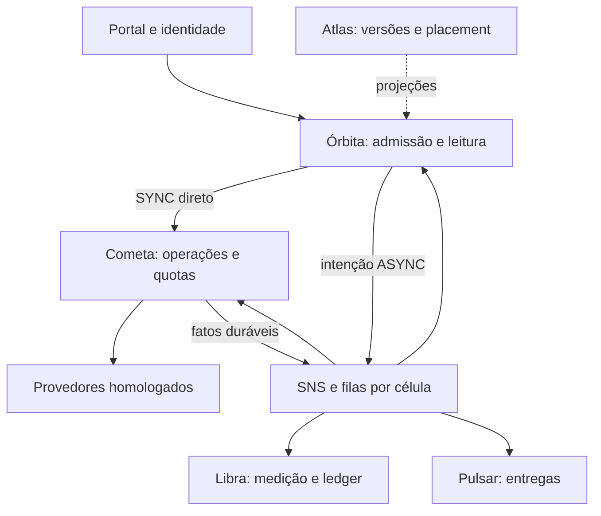

# Arquitetura de evolução e razões das escolhas

Status: decisão proposta para implementação R2; conserva as fronteiras e requisitos v4. Não representa infraestrutura implantada ou produto qualificado.

## Diagnóstico e orientação

O problema principal não é a linguagem nem a ausência de mais microserviços. O scaffold já tem cinco aplicações de negócio coerentes. Faltam autoridades duráveis, contratos executáveis, isolamento e jornadas completas. Reescrever tudo em outra stack aumentaria o custo sem fechar os gaps identificados. A evolução mantém as cinco autoridades; um mesmo binário pode ter papéis de runtime em Deployments separados para reservar recursos e escalar corretamente.

| Componente | Tecnologia e linguagem propostas | Por que manter/adotar | Custo, limite e critério de qualificação |
|---|---|---|---|
| Portal | Kong; configuração declarativa, sem lógica de domínio em plugin | Gateway já presente; centraliza TLS, validação inicial, limites e rotas | Edição/plugin OIDC depende de P-01; gateway não substitui autorização no serviço. Validar claims e cabeçalhos efetivamente encaminhados |
| Atlas | Go; PostgreSQL hub_control | Reutiliza handlers/domínio e uniformiza operação; SQL permite versões, vigência, integridade e publicação auditável | Criar projeções assinadas/versionadas; não consultar Atlas a cada pedido. Controle separado dos pools de execução |
| Órbita | Go; PostgreSQL core por célula | Runtime concorrente e bibliotecas HTTP; transações curtas para protocolo, DAG, intenção e final | Goroutine não é recurso ilimitado. Filas internas, pools e paralelismo limitados. Hot path deve ser medido |
| Cometa | Go; adapters declarativos limitados e módulos homologados; PostgreSQL core de sua autoridade | Mesma stack para I/O, pooling, deadlines, polling e quotas. Adapter especializado pode ser isolado por risco sem novo domínio de negócio | Não prometer suporte genérico a toda API. Segredo real, idempotência e semântica de resposta precisam homologação por parceiro |
| Pulsar | Go; agenda/recibos duráveis; HTTP autenticado | Reaproveita execução I/O e separa entrega do resultado da operação externa | Um cliente lento não pode bloquear outros. HMAC comprova integridade, não entrega exactly-once nem processamento do receptor |
| Libra | Go; PostgreSQL hub_finance; decimal exato | Uniformidade operacional e transações para saldo e journal balanceado | Proibir float64 em valor monetário e valor calculado no navegador. Qualificar arredondamento, moeda e lock concorrente com Financeiro |
| Console | TypeScript + React + Vite; SPA servida em container estático com fallback de rotas | Já existem no repo; tipagem e componentes favorecem formulários/jornadas, sem custo de SSR para administração autenticada | Adicionar roteamento por URL e camada de consulta/invalidação; bibliotecas auxiliares devem ser fixadas e avaliadas por ADR. TypeScript não valida resposta de rede em runtime |
| Banco | PostgreSQL, três funções lógicas e core/finance por célula | ACID, constraints, índices, RLS e migrations; autoridade única preserva idempotência e saldo | Réplica não é writer alternativo; RLS precisa testar papéis que a contornam. Escala de dados usa células/particionamento planejado, não HPA |
| Mensageria | SNS + SQS Standard na referência AWS; LocalStack no ensaio | Stack já integrada; fan-out de fatos e filas por consumidor/célula | Ordem e exactly-once não presumidos; outbox/inbox e fencing pertencem ao Hub. LocalStack não prova HA/limites da AWS |
| Objetos | S3 por versão/chave imutável; upload direto/multipart | Evita transferir grandes corpos por gateway/broker e buffers integrais | FileRef autorizado e validado; S3 não é transação conjunta com PostgreSQL; reconciliar órfãos. Limites máximos específicos não são fixados nesta revisão |
| Segredos | Secrets Manager + KMS na referência AWS; identidade de workload | Cofre e rotação por referência, sem expor valores no controle | Tokens/segredos somente em L1 privado autorizado; Redis não é cofre. Cache válido não permite ignorar revogação |
| Cache | L1 limitado; Redis L2 opcional apenas para dados permitidos | Reduz consultas repetidas e pressão; modo sem Redis deve ser primeira classe | Bypass com timeout/circuito; tamanho máximo e validade; nunca único registro de protocolo, lock financeiro ou token compartilhado |
| Métricas | Prometheus e biblioteca de instrumentação compatível | Histogramas/counters e alertas úteis ao HPA/KEDA e SLO | Labels controlados; alto número de clientes não pode multiplicar séries por protocolo/evento |
| Logs | Loki + Alloy | Coleta padronizada de logs estruturados, pesquisa correlacionada | Sanitizar; limitar buffers; indisponibilidade do coletor não bloqueia negócio. Auditoria durável é outro dado |
| Visualização | Grafana; dashboards provisionados | Visão de SLA, pressão, filas, financeiro e investigação | Painéis não substituem API autorizada de consulta operacional; links respeitam RBAC |
| Traces | OpenTelemetry + Tempo | Mede trechos de latência e acompanha execução direta/assíncrona | Propagar traceparent/causalidade; UUID de protocolo continua separado de trace; sampling não prova ausência de perda |
| Execução | Docker Compose local, kind no laboratório, Kubernetes/EKS remoto de referência | Mesma imagem e contratos operacionais; laboratório ensaia probes/rollout/escala | kind não oferece zonas físicas; EKS/região/conta/custos seguem P-01. Testar integração de rede, ingress e identidade |
| Elasticidade | HPA para papéis HTTP, KEDA para workers; Karpenter para nós; Atlas + Crossplane para células | Responsabilidades distintas fecham o ciclo de capacidade | Um controlador por Deployment; KEDA pode criar seu HPA. Definir piso aquecido e capacidade N−1; ausência de controlador instalado não equivale a escala |
| IaC e promoção | Terraform para fundação, Crossplane para células sob política, overlays/GitOps para workloads | Mantém referência existente e separa bootstrap de crescimento | Um dono por recurso. State remoto protegido contém segredos gerados; não tratar random_password como ausência de segredo no state |

Go é mantido por uniformidade e suporte à concorrência de I/O; a documentação de [goroutines](https://go.dev/doc/faq#goroutines) sustenta essa capacidade, não um benchmark do Hub. A separação entre HPA e KEDA segue seus modelos documentados: [HPA](https://kubernetes.io/docs/tasks/run-application/horizontal-pod-autoscale/), [KEDA](https://keda.sh/docs/2.20/concepts/scaling-deployments/). Versões exatas de produção devem ser registradas e verificadas na implementação; a versão usada para compilar esta revisão não é recomendação de suporte futuro.

## Comunicações que a implementação deve respeitar

| Origem → destino | Tipo definido | Confirmação e falha |
|---|---|---|
| Cliente → Portal → Órbita | HTTPS REST/JSON; perfis legados homologados na borda de domínio; HTTP/2 negociável | Identidade e contrato antes de efeitos; protocolo após aceite durável |
| Órbita → Cometa, SYNC | HTTPS direto idempotente com identidade de workload e deadline | Retorno só afirma final externo conservado; resposta perdida recupera command_id, sem novo submit |
| Órbita → Cometa, ASYNC/AUTO | Intenção transacional → SQS da célula/classe | 202 depende da custódia, não da presença imediata do consumidor |
| Cometa → Órbita/Libra | Fato conservado → SNS → filas independentes | Inbox e efeito local antes de ACK; em SYNC o mesmo fato também retorna pela conexão direta |
| Órbita → Pulsar/Libra | Fato final durável → SNS/SQS | Webhook e apuração não seguram resposta final do cliente |
| Órbita → Libra | HTTPS idempotente para saldo/franquia estrita | Só liberar efeito após reserva confirmada; pós-pago não exige chamada síncrona a Libra |
| Atlas → aplicações | Evento de versão + consulta HTTPS de versão imutável/projeção | Material local com validade; ressincronizar lacunas; segurança de revogação explícita |
| Cometa → provedor | Protocolo do adapter homologado: inicialmente REST/JSON; status/fetch/cancel conforme parceiro | Autenticação efetiva do binding; TLS, limites, quota e classificação de resultado |
| Provedor → Cometa | Callback autenticado para rota dedicada | Persistir recibo antes do ACK; resultado de negócio pode ser rejeitado por SLA sem rejeitar transporte |
| Pulsar → cliente | HTTPS webhook conforme perfil do resultado | Mesmos bytes de GET; chave/destino versionados; 2xx é recebimento HTTP |
| Cliente → objeto | URL de acesso temporário emitida após autorização sobre FileRef | Sem URL volátil no corpo final imutável; validade e proteção por objeto |

Não introduzir gRPC obrigatório ou request/reply sobre broker no SYNC. SOAP/XML, SFTP e gRPC são capacidades possíveis somente quando exigidas pelo portfólio e homologadas; não são implementadas por apenas declarar seu nome no catálogo.

## Fronteiras e paralelismo

Cada aplicação tem autoridade definida; o diagrama omite stores e detalhes para mostrar somente caminhos. Órbita leitura/admissão podem ser papéis distintos; Cometa direto/callback/workers também; Libra reserva e apuração idem. Isso evita escalar uma API crítica somente pelo backlog de um worker do mesmo processo. Pools, filas e capacidade por classe são parte do isolamento, não só réplicas de pods.

## Decisões técnicas abertas que exigem prova antes do fechamento

| ID técnico R2 | Problema | Direção proposta e alternativa | Prova exigida / responsável |
|---|---|---|---|
| T-R2-01 | Confirmar durabilidade estritamente antes de deadline, inclusive commit lento | PostgreSQL segue autoridade. Provar mecanismo de ordenação/commit e limite de incerteza do relógio. Comparar now() no UPDATE ou registrar timestamp do início da transação é insuficiente. Alternativa que relaxa o SLA para instante de decisão exige mudança explícita de EXE-11, não está aprovada | Core/Dados: ensaio com commit atrasado, relógio divergente, callback/timer e relay concorrentes; sem prova, não publicar sucesso elegível |
| T-R2-02 | Adapter da API HivePlace importada | Homologar operações com sandbox e exemplos sanitizados; metadata importada vira rascunho | Integrações: principal externo, request e resultado real, erros, polling, idempotência; não usar credencial do simulador |
| T-R2-03 | OIDC no Kong e frontend | Authorization Code + PKCE para SPA; token curto em memória, sem segredo de cliente no navegador. Se gateway oferecer sessão cookie, documentar CSRF/SameSite e não misturar dois modelos sem necessidade | Segurança/Plataforma: edição/licença, verificação de claims, logout/revogação, fluxo UI e workloads |
| T-R2-04 | Escopo global de quota externa | capacity_domain possui autoridade Cometa designada e leases com orçamento agregado entre células; reserva distribuída explícita, sem chave Redis como única autoridade | Integrações/Core: provar soma de créditos e pendências, takeover, partição e domínio compartilhado entre contas |
| T-R2-05 | Consolidação da baseline OpenSpec | Preservar v4 aberta como alvo; R2 acrescenta capabilities próprias. Consolidar árvore canônica posteriormente por revisão, sem declarar código pronto ao copiar specs | Liderança/Qualidade: mapa dos 98 IDs, conclusão por cenário e validação CLI |

Esses itens não pedem confirmação durante esta entrega documental. São tarefas de engenharia com gates claros. T-R2-01 não está resolvido pelo desenho de outbox; tratá-lo como tal repetiria um dos problemas da implementação atual.

## Alternativas avaliadas

- Kafka em lugar de SNS/SQS: não resolve ACK prematuro, posse ou saldo. Adiar troca até requisito de replay/streaming justificar custo e operação adicionais.
- Temporal/BPMN como orquestrador: pode simplificar timers/retries, mas não substitui contratos de efeito, ledger ou SLA. O DAG limitado cabe na autoridade Órbita; avaliar apenas se complexidade comprovada superar esse modelo.
- Redis como fallback de escrita: rejeitado para custódia e saldo, pois criaria autoridade conflitante e perda de estado. Usar somente aceleração dispensável.
- Um banco por cliente: custo operacional desnecessário por padrão; preferir células com placement e classe dedicada quando o perfil exige.
- Rust/Java em reescrita geral: sem benchmark indicando necessidade. Preservar Go e medir; adapter nativo isolado pode ter escolha específica justificada.
- Tornar tudo assíncrono: contraria SYNC pedido pelo usuário. Filas permanecem fora do percurso obrigatório do final SYNC.
